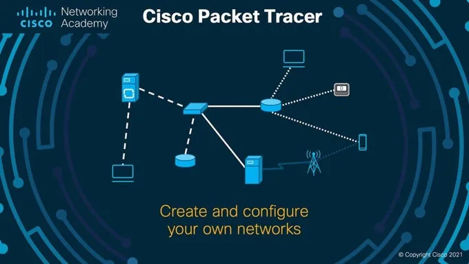

## Calculs de masques 

###### Exemples 

- VLAN 10  40 hôtes = 255.255.255.192
- VLAN 20  65 hôtes = 255.255.255.128
- VLAN 30  30 hôtes = 255.255.255.224
- VLAN 40  3000 hôtes = 255.255.224.0
- VLAN 50  10 hôtes = 255.255.255.224
- VLAN 60  5 hôtes = 255.255.255.248
- VLAN 70  16000 hôtes = 255.255.192.0
- VLAN 80  1000 hôtes = 255.255.252.0

## Configuration des équipements 

###### Router 

- Activation des interfaces :

```
Router> en
Router## conf t
Router(config-if)## interface gigabitEthernet 0/0
Router(config-if)## no shutdown
```

- Configuration des passerelles entre routeurs :

```
Router(config)## interface gigabitEthernet 0/0
Router(config-if)## ip address 192.168.92.2 255.255.255.252
Router(config-if)## no shutdown
Router(config-if)## exit

Router(config)## interface serial 0/3/0
Router(config-if)## ip address 192.168.93.1 255.255.255.252
Router(config-if)## no shutdown
Router(config-if)## exit
Router(config)## do write memory
```

###### Switch 

- Configuration de VLAN :

```
Switch> en
Switch## conf t
Switch(config)## vlan 10
Switch(config-vlan)## name VLAN10
Switch(config-vlan)## exit
Switch(config)## vlan 20
Switch(config-vlan)## name VLAN20
Switch(config-vlan)## exit
Switch(config)## vlan 30
Switch(config-vlan)## name VLAN30
Switch(config-vlan)## exit
Switch(config)## vlan 40
Switch(config-vlan)## name VLAN40
Switch(config-vlan)## exit
Switch(config)## vlan 50
Switch(config-vlan)## name VLAN50
Switch(config-vlan)## exit
Switch(config)## vlan 60
Switch(config-vlan)## name VLAN60
Switch(config-vlan)## exit
Switch(config)## vlan 70
Switch(config-vlan)## name VLAN70
Switch(config-vlan)## exit
Switch(config)## vlan 80
Switch(config-vlan)## name VLAN80
Switch(config-vlan)## exit
```

- Configuration des ports d'accès et de trunk :

```
Switch(config)## interface fastEthernet 0/1
Switch(config-if)## switchport mode access
Switch(config-if)## switchport access vlan 10
Switch(config-if)## exit
Switch(config)## interface gigabitEthernet 0/1
Switch(config-if)## switchport mode trunk
Switch(config-if)## switchport trunk allowed vlan <vlan-list>
Switch(config-if)## exit
```

###### Router 

- Configuration du VLAN :

```
Router> en
Router## conf t
Router(config)## interface gigabitEthernet 0/0.100
Router(config-subif)## encapsulation dot1Q 100
Router(config-subif)## ip address 192.168.110.3 255.255.255.192
Router(config-subif)## do write memory
```

## Configuration des protocoles de routage 

###### RIP (Routing Information Protocol) 

- Définition  Le protocole RIP est un protocole de routage basé sur le nombre de sauts (hops) pour déterminer la meilleure route vers une destination.
- Configuration :

```
Router> en
Router## conf t
Router(config)## router rip
Router(config-router)## version 2
Router(config-router)## network 198.162.10.0
Router(config-router)## network 198.162.20.0
Router(config-router)## network 198.162.30.0
Router(config-router)## network 198.162.40.0
Router(config-router)## network 198.162.50.0
Router(config-router)## network 198.162.60.0
Router(config-router)## network 198.162.70.0
Router(config-router)## network 198.162.80.0
Router(config-router)## network 198.162.90.0
Router(config-router)## exit
```

**⇒ SUR CHAQUE ROUTEUR !**

###### Protocole OSPF (Open Shortest Path First) 

- Définition  Le protocole OSPF est un protocole de routage à état de lien qui calcule les chemins les plus courts entre les périphériques réseau.
- Configuration :

```
Router> en
Router## conf t
Router(config)## router ospf 1
Router(config-router)## network 198.162.90.0 0.0.0.255 area 0
```

## Configuration DHCP 

###### DHCP Pool pour un VLAN spécifique 

- Définition  DHCP permet d'attribuer dynamiquement des adresses IP aux périphériques d'un réseau.
- Configuration :

```
Router> en
Router## conf t
Router(config)## ip dhcp pool vlan100
Router(dhcp-config)## network 192.168.100.0 255.255.255.192
Router(dhcp-config)## default-router 192.168.100.3
Router(dhcp-config)## exit
```

## Configuration des Ordinateurs 

- Ipv4 address (N’importe)
- Gateway = /* ip dans routeur vlan */

## Configuration HSRP (Hot Standby Router Protocol) 

###### Router 1 

- Configuration :

```
Router> en
Router## conf t
Router(config)## interface gigabitEthernet 0/1
Router(config-if)## standby version 2
Router(config-if)## standby 1 ip 192.168.10.251
Router(config-if)## standby 1 priority 150
Router(config-if)## standby 1 preempt
```

###### Router 2 

- Configuration :

```
Router> en
Router## conf t
Router(config)## interface gigabitEthernet 0/1
Router(config-if)## standby version 2
Router(config-if)## standby 1 ip 192.168.10.251
Router(config-if)## standby 1 priority 150
Router(config-if)## standby 1 preempt
```

## Telnet 

###### Routeur (Tunnel Virtuel - Connection à distance) 

- Configuration :

```
Router> en
Router## conf t
Router(config)##line vty 0 1
Router(config-line)##password IPSSI
Router(config-line)##login
Router(config-line)##exit
Router(config)##enable password cisco
```

###### Routeur (Câble Console) 

- Configuration :

```
Router> en
Router## conf t
Router(config)##line console 0
Router(config-line)##password IPSSI
Router(config-line)##login
Router(config-line)##exit
Router(config)##enable password cisco
```

###### PC 

- Configuration :

```bash
C\\>telnet 192.168.0.1
```

## SSH 

###### Routeur 

- Configuration :

```
Router> en
Router## conf t
Router(config)##ip domain-name ipssi.com
Router(config)##crypto key generate RSA (-> 1024)
Router(config)##username thib password ipssi
Router(config)##line vty 0 4
Router(config-line)##login local
Router(config-line)##transport input ssh
```

###### PC 

- Configuration :

```bash
C\\>ssh -l thib 192.168.2.1
```

## Voice 

###### Routeur

- Configuration :

```
Router> en
Router## conf t
Router(config)## ip dhcp pool voice
Router(dhcp-config)## network 192.168.100.0 255.255.255.192
Router(dhcp-config)## default-router 192.168.100.3
Router(dhcp-config)## option 150 ip 192.168.0.1
Router(dhcp-config)## exit
Router(config)## telephony-service
Router(config-telephony)## max-dn 5
Router(config-telephony)## max-ephones 5
Router(config-telephony)## ip source-address 192.168.0.1 port 2000
Router(config-telephony)## auto assign 1 to 4
Router(config-telephony)## exit
Router(config)## ephone-dn 1
Router(config-ephone-dn)## number 54001
Router(config-ephone-dn)## ephone-dn 2
Router(config-ephone-dn)## number 54002
Router(config-ephone-dn)## exit
```

###### Switch 

- Configuration :

```
Switch(config)## int range 
```

### Hostname 

- Configuration :

```
Router(config)##hostname Routeur1
```

### Range 

```
Router> en
Router## conf t
Router(config)##interface range fastEthernet 0/1-14
```

## Trooble-Shooting 

###### Routeur 

- Configuration :

```
- do sh ru
- do sh ip int br
- do sh ip ro o
- do show vlan
- do sh standby
```

###### Switch 

- Configuration :

```
- do sh int sta 
```
